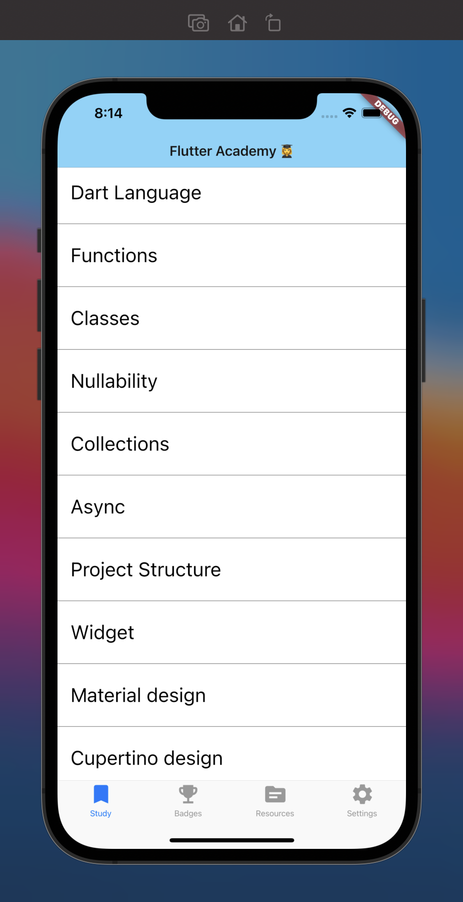
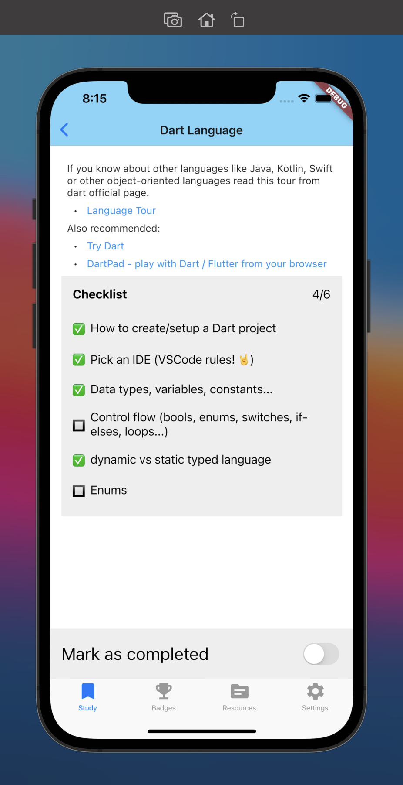

# Flutter Academy Capstone App 👩‍🎓

An app with a roadmap to help you organise your studies in Dart and Flutter.
This app was made as a capstone app during **Flutter Bootcamp @ GDG London**.

<table >
    <tr>
        <td></td>
        <td></td>
        <td></td>
    </tr>
</table>

# Stack 📚

## Back-end 🚪

All content is **retrieved by an owned API**, implemented in `Node.js` with `Express.js` and hosted on **Google Cloud** (servless) using docker containers.

## Front-end 🖼

The initial version of this app was made in **Flutter**, with Cupertino (iOS) as default design.

### Dependencies 📦

* `http`: for the http API connection

* `flutter_markdown`: for rendering markdown content

* `url_launcher`: to open links

* `flutter_riverpod`: state management

# Next Steps 🚶‍♀️

Many shortctus were taken during the development of this application. Here's what I'd work on next, with more time available.

## Functionalities 📱

* Implement list of badges

* Implement list of resources, like youtube channels, books, etc

* Implement Settings, such as font size, dark mode and so on

* Layout improvements overall

* A better support for Android with Material design

* A better support for web

## Code 👩‍💻

* Improve state management

* Implement Widget tests and Unit tests

* Continuous deployment to Google Cloud

* Offline mode

* Persist data such as checklist
